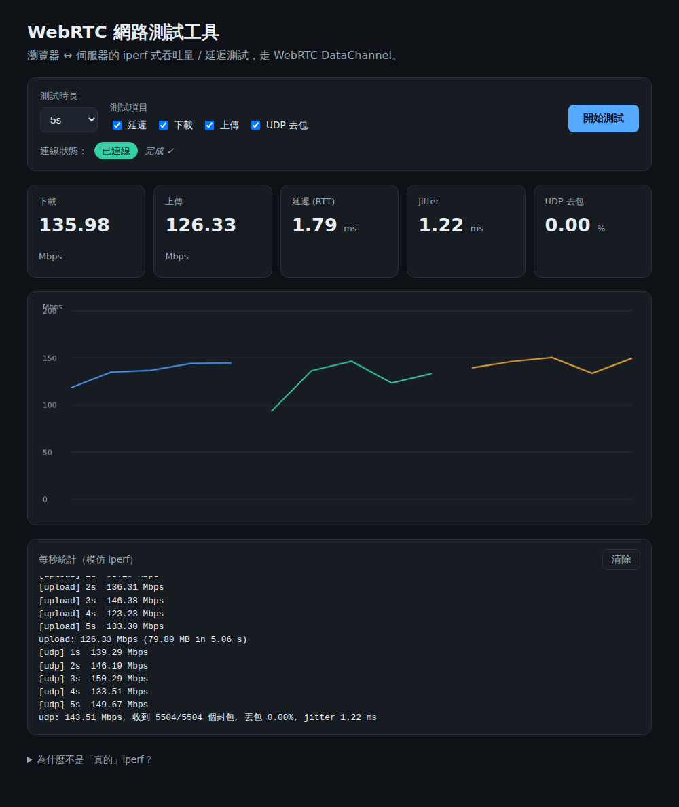

# webrtctesttool

網頁版的 **iperf 式網路測試工具**：在瀏覽器與伺服器之間，透過 **WebRTC DataChannel**
量測吞吐量（下載 / 上傳）、延遲（RTT）、jitter 與 UDP 丟包率。



## 為什麼不是「真的」在網頁上跑 iperf？

瀏覽器沙箱**不允許網頁存取原始 TCP/UDP socket**，所以無法在頁面裡執行原生
`iperf` / `iperf3` 執行檔（即使把 iperf 編成 WebAssembly，也一樣拿不到 socket）。

因此本工具改用瀏覽器唯一能做「自訂資料傳輸」的原生管道——**WebRTC DataChannel**
（SCTP over DTLS over UDP）——在你的瀏覽器和伺服器之間傳送資料來測量。量到的結果反映的是
**「你這台瀏覽器到伺服器」的真實連線品質**，這正是原生 iperf 在網頁情境做不到的事。

對應關係：

| iperf 概念 | 本工具做法 |
|-----------|-----------|
| TCP 吞吐量 | 可靠、有序的 DataChannel（下載 / 上傳） |
| UDP 吞吐量 + 丟包 / jitter | 不可靠、免重傳（`ordered:false, maxRetransmits:0`）的 DataChannel，封包帶序號 |
| 每秒一行的 interval 統計 | 前端每秒回報一次，並即時畫折線圖 |
| client ↔ server | 瀏覽器（client）↔ 伺服器（固定 WebRTC peer） |

## 架構

```
瀏覽器 (public/app.js)                Node 服務 (server/)
  RTCPeerConnection  ──── WebSocket 訊令 ────  werift RTCPeerConnection
  DataChannel × 3    ═════ WebRTC / SCTP ═════  DataChannel × 3
  (ctrl / data / udp)                          (ctrl / data / udp)
```

- **前端**：純 HTML / CSS / JS，無打包工具、無外部 CDN；折線圖用原生 `<canvas>` 手繪。
- **後端**：單一 Node.js 服務，同時負責靜態網頁、WebSocket 訊令（signaling）、以及
  用 [`werift`](https://github.com/shinyoshiaki/werift-webrtc)（純 TypeScript 的 WebRTC 實作，
  **無原生編譯依賴**）擔任伺服器端的固定 WebRTC peer。

瀏覽器是 WebRTC 的 initiator：建立三條 DataChannel、送出 SDP offer；伺服器回 answer，
雙方交換 ICE candidate 後即建立 P2P 連線，測試協定跑在 DataChannel 上。

### DataChannel 用途

| Label | 屬性 | 用途 |
|-------|------|------|
| `ctrl` | 可靠、有序 | JSON 控制訊息、ping/pong、上傳的 interval / summary 回報 |
| `data` | 可靠、有序 | 下載 / 上傳的二進位資料塊（TCP 式吞吐量） |
| `udp`  | 不可靠、免重傳 | 帶序號的資料塊，量丟包率與 jitter（UDP 式） |

## 安裝與執行

需要 Node.js 16.16.0 以上（相容性細節見下方「Node.js 相容性」）。

```bash
npm install
npm start
# 開啟 http://localhost:3000
```

用瀏覽器開啟頁面 → 選測試時長與項目 → 按「開始測試」。

自訂連接埠：`PORT=8080 npm start`。

## Node.js 相容性

支援 **Node.js 16.16.0 以上**（含較舊的地端環境）。已在真正的 Node 16.16.0 上實測
連線與四項測試皆正常。

需要注意的一點：後端 WebRTC 由 `werift`（純 TS）擔任，它相依的
`@peculiar/x509` **最新版（1.14.1+）宣告需要 Node 20/22**。為了在 Node 16 上安裝，
`package.json` 用 npm `overrides` 把它釘在最後一個不要求新 Node 的版本：

```json
"overrides": { "@peculiar/x509": "1.14.0" }
```

這仍滿足 werift 的 `@peculiar/x509: ^1.12.3` 需求。若你把 Node 升到 20/22，此
override 可保留（無害）或移除皆可。werift 的 WebRTC DTLS 憑證用 ECDSA P-256、
透過 `crypto.webcrypto`（Node 15+ 即有），故在 Node 16 可正常產生憑證。

> 離線 / `npm ci` 部署務必連同 `package-lock.json` 一起帶走，才會鎖到正確的
> `@peculiar/x509@1.14.0`。

## 測試項目

- **延遲 (Latency)**：連續 ping/pong，取 RTT 的 min / avg / max 與 jitter。
- **下載 (Download)**：伺服器往瀏覽器灌資料，瀏覽器每秒統計吞吐量。
- **上傳 (Upload)**：瀏覽器往伺服器灌資料，伺服器每秒回報吞吐量。
- **UDP 丟包**：伺服器送出帶序號的封包（不可靠 channel），瀏覽器依收到的封包數
  與序號算出丟包率與 jitter。

吞吐量的關鍵是**流量控制**：傳送端維持 DataChannel 的 `bufferedAmount` 在
高低水位之間（`bufferedAmountLowThreshold` + `bufferedamountlow` 事件），
才能吃滿鏈路又不讓送出緩衝無限膨脹。

## 部署

### 1. 伺服器端

需要一台有公開 IP（或經反向代理可達）的機器、Node.js 16.16.0+。

```bash
git clone <repo-url> && cd webrtctesttool
git checkout claude/iperf-web-p59194
npm install
PORT=3000 node server/index.js
```

正式環境建議用行程管理器常駐（systemd / pm2）。

### 2. 環境變數（部署用設定）

所有 WebRTC / 網路設定都用環境變數控制，不必改程式碼：

| 變數 | 說明 | 範例 |
|------|------|------|
| `PORT` | HTTP / WebSocket 監聽埠 | `3000` |
| `PUBLIC_IP` | 伺服器對外可達的公開 IP。雲端 VM 多半是 1:1 NAT（內網只看得到私有 IP），設了才會把公開 IP 當成 host candidate 廣告出去 | `203.0.113.10` |
| `ICE_PORT_MIN` / `ICE_PORT_MAX` | 把 ICE 用的 UDP 埠固定在一個範圍，方便開防火牆（兩個要一起設） | `40000` / `40100` |
| `STUN_URL` | 自訂 STUN（預設 Google 公用） | `stun:stun.l.google.com:19302` |
| `TURN_URL` / `TURN_USERNAME` / `TURN_CREDENTIAL` | 對稱式 NAT 後方的用戶端需要 TURN 中繼時設定 | `turn:turn.example.com:3478` |

瀏覽器端會自動向伺服器的 `GET /config` 取得同一份 `iceServers`（含 TURN），
所以 **TURN 帳密只設在伺服器**、不必改前端。

範例（雲端 VM，固定 UDP 埠 + 公開 IP）：

```bash
PORT=3000 PUBLIC_IP=203.0.113.10 ICE_PORT_MIN=40000 ICE_PORT_MAX=40100 \
  node server/index.js
```

### 3. 防火牆 / 安全群組

- **TCP**：對外開放 HTTP/WebSocket 埠（`PORT`，或經反向代理的 80/443）。
- **UDP**：開放 `ICE_PORT_MIN`–`ICE_PORT_MAX`（若未設則需允許臨時 UDP 埠）。
  WebRTC 的實際資料走這些 UDP 埠，沒開會連不上。

### 4. HTTPS（建議）

用 nginx / Caddy 之類的反向代理掛上 TLS，同時代理 HTTP 與 `/ws`（WebSocket 需
`Upgrade` header）。頁面走 HTTPS 時，前端會自動改用 `wss://` 連訊令伺服器。

Caddy 範例：

```
測試網域.example.com {
    reverse_proxy 127.0.0.1:3000
}
```

### 5. 發起方（瀏覽器）

使用者端**不需要安裝任何東西**：用現代瀏覽器（Chrome / Edge / Firefox / Safari，
近幾年版本都支援 WebRTC）開啟你的網址即可（`https://測試網域.example.com` 或
`http://伺服器IP:3000`），選好項目按「開始測試」。

- 若企業防火牆封鎖 UDP 導致連不上，就需要走 **TURN**（可設定成 TCP/TLS 443 中繼）。
- 建議正式環境走 HTTPS，避免部分瀏覽器對非安全來源的限制。

## 地端 / 離線（air-gapped）安裝

**可以完全離線執行**，而且同一區網內比公網部署更單純——因為兩端直接用 host
candidate 互連，**根本不需要 STUN/TURN，不會連任何外部服務**。

需要處理的只有兩件事：Node 執行環境與相依套件都得先帶進離線設備。

1. **Node.js 執行環境**：離線設備要先裝好 Node 16.16.0+（把安裝檔一起帶進去）。

2. **相依套件**（`npm install` 需要網路，離線機無法直接跑）——擇一：
   - 在一台**有網路**的機器上 `npm install`，再把**整個資料夾（含 `node_modules/`）**
     複製到離線設備即可（本專案相依為純 JS，無原生編譯，跨機複製沒問題）。
   - 或用 npm 離線快取 / 私有 registry（`npm ci --offline`）。

3. **關閉 STUN/TURN**：用 `LAN_ONLY=1` 啟動，`iceServers` 會是空的，
   完全走 host candidate，不對外連線：

   ```bash
   LAN_ONLY=1 PORT=3000 node server/index.js
   # 使用者瀏覽器開 http://<設備區網IP>:3000
   ```

4. **前端本來就自足**：無外部 CDN、無 web 字型、無外部 API，所有 HTML/CSS/JS
   都由本機伺服器提供，離線可正常載入與繪圖。

5. **HTTPS**：`RTCPeerConnection` / DataChannel 在非安全來源（`http://` 的區網 IP）
   也能運作，離線 LAN 用 HTTP 即可；若要 HTTPS 需自備內部憑證。

> 已實測：`LAN_ONLY=1` 時 `/config` 回傳空 `iceServers`，連線僅用 host candidate
> 即建立成功、四項測試皆正常。

## 已知限制

- `werift` 是純 JavaScript 的 SCTP / DTLS 實作，吞吐量會受 **CPU** 限制，
  在低階機器上可能無法達到很高的 Mbps。它量測的是「瀏覽器到這台伺服器」的
  連線，適合相對比較與連線品質檢測，不宜當作絕對頻寬的權威數字。
- 單一伺服器 peer；未做多使用者資源上限管理。

## 專案結構

```
webrtctesttool/
├── server/
│   ├── index.js       # http + express 靜態檔 + WebSocket 訊令掛載
│   ├── signaling.js   # 每條連線的 werift peer 與 offer/answer/candidate 中繼
│   ├── peer.js        # 伺服器端測試協定（收送資料塊、統計）
│   └── config.js      # 共用常數 + env 驅動的部署設定（ICE servers / 埠範圍 / 公開 IP）
└── public/
    ├── index.html
    ├── app.js         # 瀏覽器 WebRTC、測試流程、canvas 折線圖
    └── styles.css
```
